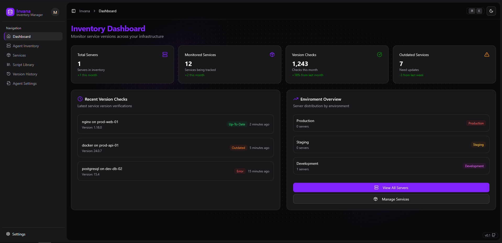
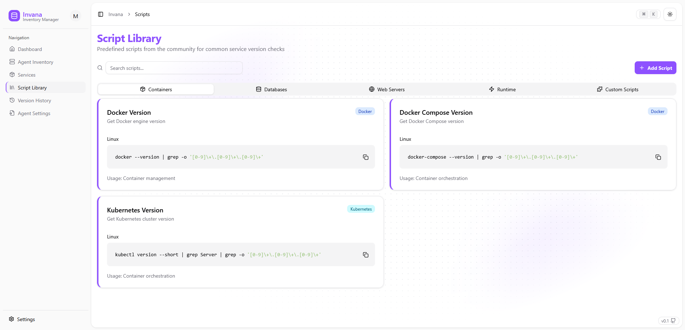
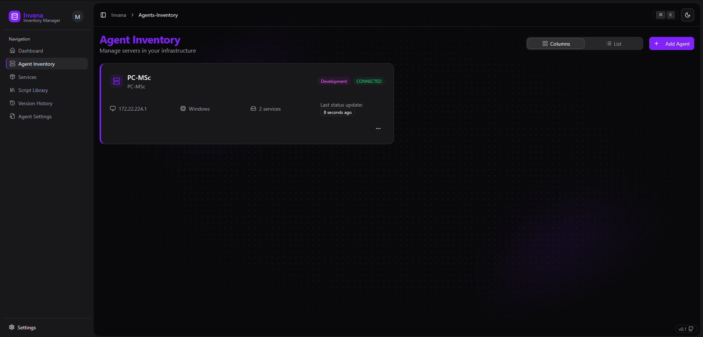
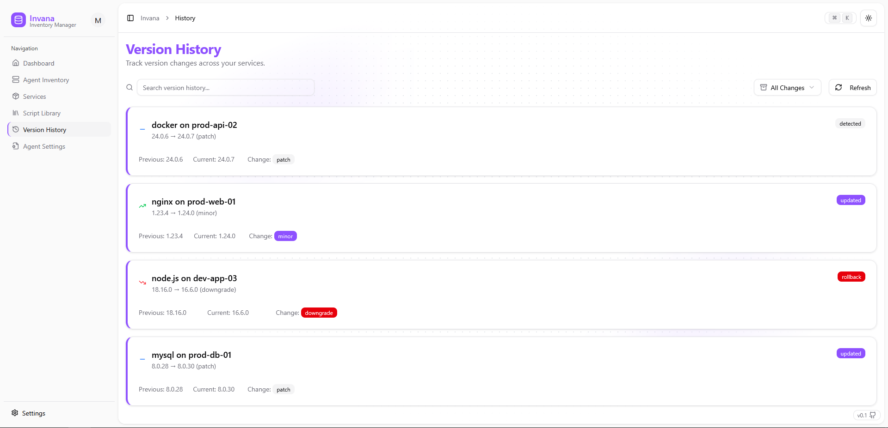

# Invana

<p align="center">
  
  
  
  
</p>

**Invana** is an open-source, self-hosted monitoring system designed to 
track service versions running on your servers. Built with flexibility and privacy
in mind, Invana helps teams gain visibility into the version landscape of their infrastructure.

> ⚠ **Status: In Development**
> 
> Invana is currently under active development.
> Features, APIs, and structure are subject to
> change

## 📦 Project Structure
- `Appliance` - Main backend (Spring Boot) & Frontend (React) for managing and viewing data.
- `Agent` - Lightweight agent that runs on monitored servers and executes detection scripts

## 🚀 Getting Started
> These instructions assume basic familiarity with Docker and/or JavaScript/Java environments.
> Full setup documentation coming soon.

### Perequisites
- Docker (optional, for appliance deployment)
- Java 17+ (for backend)
- Node.js 18+ (for frontend)
- Bash/Python (for agent)

### Quick Start (Dev Mode)
1. Clone the repository:
``` shell
~$ git clone https://github.com/maxi-schaefer/invana
~$ cd invana
~$ git checkout -b develop
```

2. Start the appliance (backend + frontend):
```shell
~$ cd ./frontend
~$ npm install
~$ npm run dev
```

For the backend import the project into your ide of choice and
start `InvanaApplication`

### Run in Docker container
1. Clone the repository:
``` shell
~$ git clone https://github.com/maxi-schaefer/invana
~$ cd invana
~$ git checkout -b develop
```

2. Build with maven
````shell
~$ mvn clean package -DskipTests
````

3. Copy ./target/invana-v.jar to  ./invana-v.jar
4. Start the container:
````shell
docker-compose up -d
````


## 🤝 Contributing
Contributions, feedback, and ideas are welcome!
- Report issues in the [GitHub Issues](https://github.com/maxi-schaefer/invana/issues)
- Fork the repo and submit a pull request
- Join discussions on features or improvements

## 📜 License
Invana is [GPL-2.0 licensed](./LICENSE)

## 💬 Contact
Made with ♥ by [maxi-schaefer](https://github.com/maxi-schaefer)