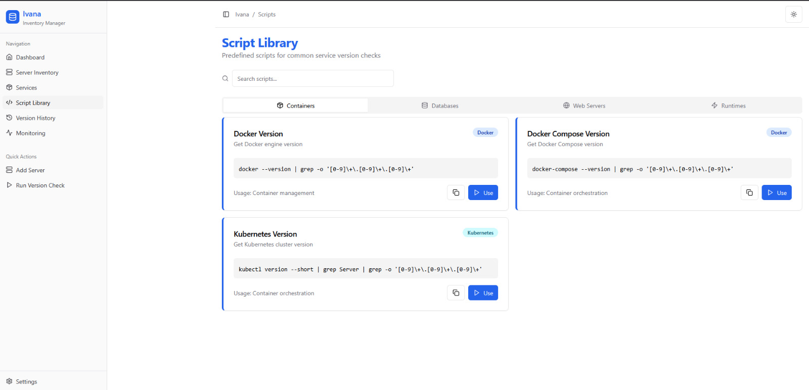

# invana (develop)



> *Version control should be elegant, not arcane.*

**ivana** is a modern, lightweight version control system built with transparency, trust, and simplicity at its core. It’s fast, intuitive, and designed to stay out of your way — giving you full control without complexity.

Welcome to the `develop` branch — where the newest ideas and features take shape. Things may break, but they also evolve here.

---

## 🚧 What's in `develop`?

This is the active development branch — new features, performance improvements, and experimental changes land here first.

Current highlights:
- ⚡ Experimental command-line enhancements
- 🔍 In-progress audit trail & state visualizer
- 🧪 Refined commit model for easier branching & merging
- 📦 Plugin system scaffolding

> **Note:** Stability is a work-in-progress. For production use, see the `main` branch.

---

## 🔧 Getting Started

```bash
git clone https://github.com/your-org/ivana.git
cd ivana
git checkout develop
```
